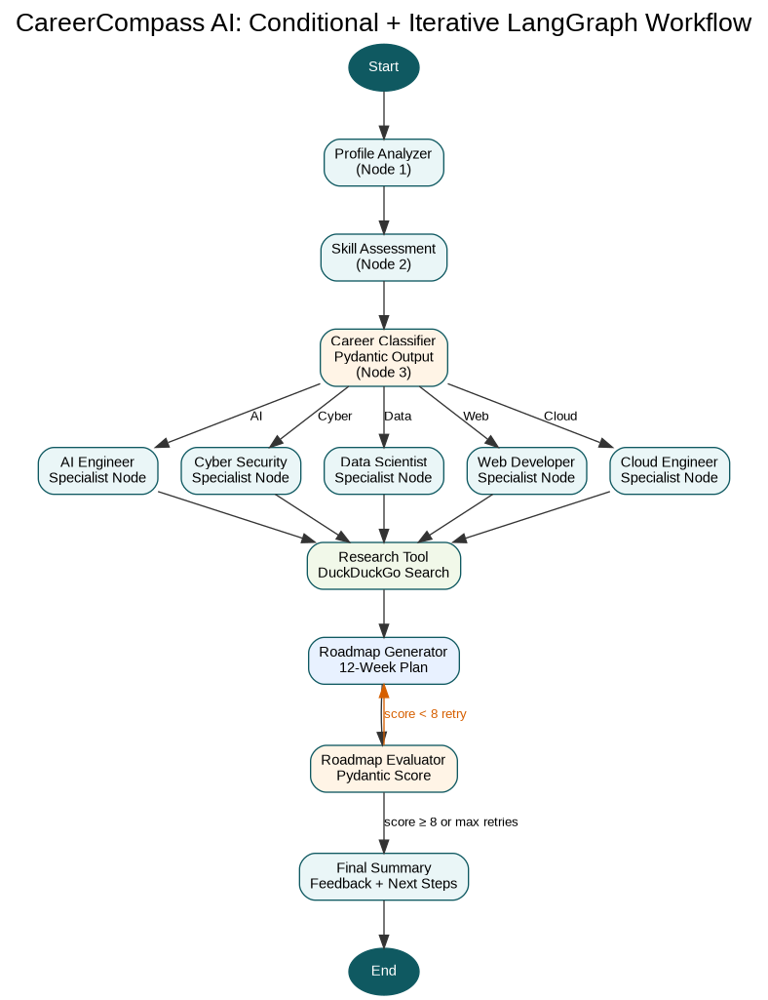

# CareerCompass AI – Career Advisor Agent

CareerCompass AI is a LangGraph-powered career advisor agent. It analyzes a student's education, interests, and skills, chooses a suitable career path, searches for latest roadmap context, generates a 12-week roadmap, evaluates the roadmap quality, and retries if the roadmap is weak.

## Workflow Type

**Conditional + Iterative Workflow**

- **Conditional:** The graph classifies the student into one career path and routes the state to the correct specialist node.
- **Iterative:** The roadmap is evaluated. If the score is below 8, the graph loops back and regenerates the roadmap with feedback.

## LangGraph Features Used

- TypedDict state management
- More than 3 meaningful nodes
- Conditional edges for career routing
- Retry loop for roadmap improvement
- Tool usage with DuckDuckGo web search
- MemorySaver with `thread_id`
- Pydantic structured output with `with_structured_output`
- Streamlit interface
- Mermaid graph visualization in notebook

## Repository Structure

```text
CareerCompass-AI/
│
├── agent.ipynb
├── app.py
├── career_agent.py
├── requirements.txt
├── README.md
├── .env.example
├── .gitignore
│
├── flowchart/
│   └── career_compass_flowchart.png
│
├── screenshots/
│   └── README.md
│
└── slides/
    └── presentation.pptx
```

## Setup in PyCharm / Mac

### 1. Open Terminal and create folder

```bash
mkdir CareerCompass-AI
cd CareerCompass-AI
```

Or unzip this submitted project and open it in PyCharm.

### 2. Create virtual environment

```bash
python3 -m venv venv
source venv/bin/activate
```

### 3. Install requirements

```bash
pip install -r requirements.txt
```

### 4. Create `.env`

```bash
cp .env.example .env
```

Open `.env` and add your real key:

```env
OPENAI_API_KEY=your_real_openai_api_key_here
OPENAI_MODEL=gpt-4o-mini
```

**Important:** Never upload your real `.env` file to GitHub.

### 5. Run Streamlit app

```bash
streamlit run app.py
```

Open the local URL shown in terminal, usually:

```text
http://localhost:8501
```

## Run Notebook

Open `agent.ipynb` in PyCharm or VS Code and run all cells. The notebook includes:

- package install cell
- graph import/build cells
- MemorySaver config with `thread_id`
- test runs for AI Engineer and Cyber Security examples
- Mermaid PNG graph visualization with `draw_mermaid_png()`

## Flowchart



## Demo Inputs

### AI Engineer Route

```text
Name: Faiza
Education: BS Computer Science
Interests: Machine Learning, AI agents, LangGraph, automation
Skills: Python, SQL, basic FastAPI, GitHub
```

### Cyber Security Route

```text
Name: Ali
Education: BS Software Engineering
Interests: Cyber security, ethical hacking, Linux, networking, malware analysis
Skills: Linux basics, Python basics, networking fundamentals
```

## GitHub Push Commands

```bash
git init
git add .
git commit -m "Initial commit - CareerCompass AI LangGraph Agent"
git branch -M main
git remote add origin YOUR_REPO_URL
git push -u origin main
```
